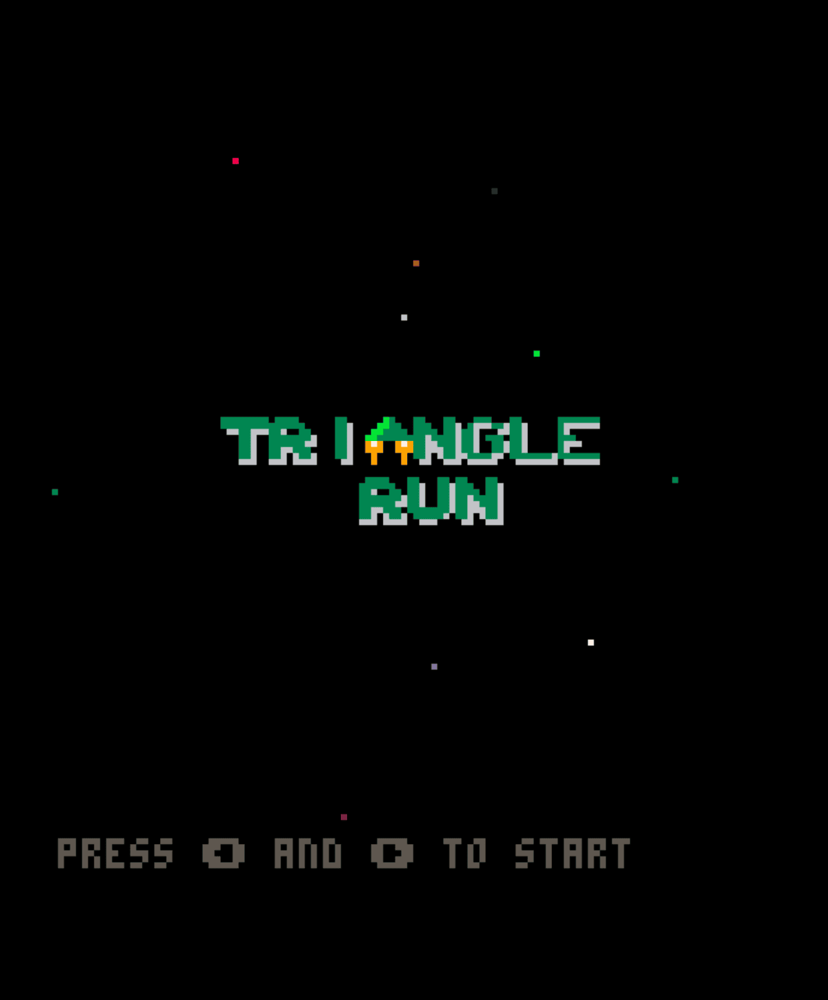
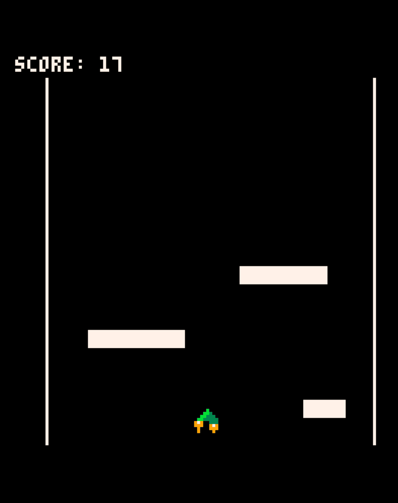
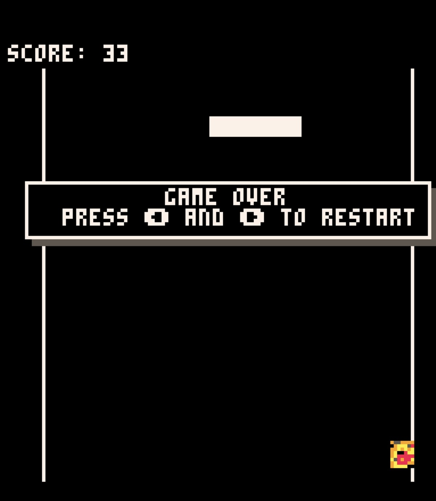

# Triangle Run

Fun runner where you control a triangle spaceship and try to avoid obstacles to reach the maximum score.

Play it live and download on the itch.io page: https://juangonzalez.itch.io/triangle-run

# Controls

Press left and right arrows to start the game.

Left/Right: accelerate in that direction.

# Credits

System Design, Code and Music: Juan Gonzalez

# Development Details

My first game developed from scratch in about 3 days using the amazing pico-8 Submission for the 2-buttons game jam. I had a lot of fun developing this game and I'm very happy with the result.

# Screenshots

